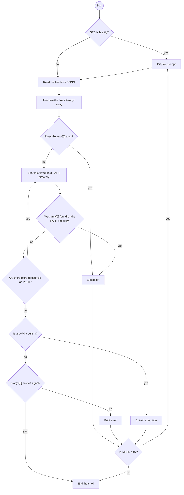

:snowflake:**simple_shell** :snowflake:

`simple_shell` program is a pseudo- recreation of the command interpreter `sh` as part of the low-level programming tasks at Holberton School Colombia.

## Dependences

`simple_shell` was coded on `Ubuntu 20.04.3 LTS` machine, using   the  `C programming language`. Test wer compiled using `gcc` compiler version 9.3.0

## Flowchart



## Usage

To use the `simple_shell`, compile all `.c` files in the repository. Then execute the resulting file. For following explanations, the executable file will be referred as `hsh`. The `simple_shell`is capable of execute any executable file, which can be called with the complete direction (for instance `/bin/ls`), or just with the name of the executable file, if it can be located at any directory of the `PATH` environment variable (for instance `ls`). 

### Example
When the hsh executable file is run, the hsh prompt will be shown. For this version, prompt is just `($)`. So, you'll see a screen like the following
```
($)_
```
The prompt is shown until you enter a command. Let's suppose that you're working on a directory with the files `Hello`, `World` and `Hello_world.c`. When you type `ls`, your screen will look like the following
```
($)ls
Hello  World  Hello_world.c
($)_
```

### Compilation:
```
$ gcc *.c -o hsh
```

### Output:
```
$ ./hsh
($)_
```

## Description

### Syntaxis
```
($)[program name] [options]
```
When `simple_shel` is run, command line are written as any other line interpreter. Hsh will attempt to execute the program name (searching into the PATH environment variable) with the arguments specified by [options]. There's a limit of 100 characters per line, including the new line character. All the tabs characters (\t) that are found in the line are removed and are not considered in the code.
### Files
The `_printf`function, available on the author profile, is used at hsh. So a copy of all of the files needed to `_printf`correct operation is on this repository.  The files needed to `hsh`correct functioning and their description are listed below.
|File| Description |
|--|--|
|`calloc.c`|recreation of the calloc stdlib.h function |
|`init_shell.c`|groups the needed functions to initialize and run the command interpreter|
|`linetoargv.c`|groups the functions that transforms a line into an array of strings used by the execve function|
|`string_functions_shell.c`|groups the string modifying functions that were not needed on `_printf.c`|
|`main.c`| main function for hsh|


## Authors
* Alejandro Pineda Sánchez <[Apinedas](https://github.com/Apinedas)> 


## Acknowledgements 

This program was written as part of the curriculum for Holberton School.
Holberton School is a campus-based full-stack software engineering program
that prepares students for careers in the tech industry using project-based
peer learning. For more information, visit [this link](https://www.holbertonschool.com/).

<p align="center">
  
</p>
